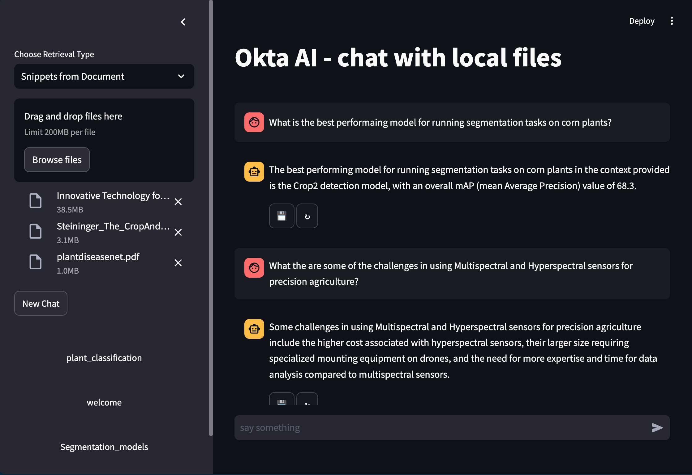

# Okta AI
Okta is a RAG (Retrieval-Augmented Generation) App that enables users to run language models (LLMs) on local files, it helps organize your file directories into seperate chat sessions.

## Quick Start
1. Clone the repository
2. Install the required packages
3. Run the app
```bash
git clone https://github.com/anas-aljanaby/Okta.git
cd Okta
pip install -r requirements.txt
streamlit run app.py
```


